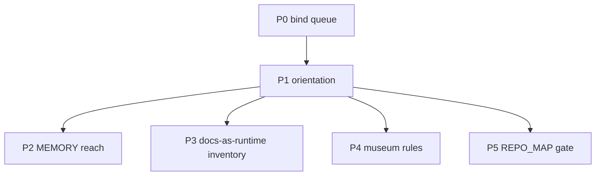

# Repo pain-point packets — sequencing charter

> **For agentic workers:** This is a **portfolio**, not one implementation. Each packet below needs its own later plan (or is already owned). Do not scaffold packet work from this file. REQUIRED when a packet is GO’d: writing-plans → a dated `docs/superpowers/plans/YYYY-MM-DD-<packet>-implementation.md`.

**AUTHORIZATION:** Plans only. No packet in this file is GO’d by committing it. Bind ([`2026-08-23-bind-operator-queue-implementation.md`](2026-08-23-bind-operator-queue-implementation.md)) **GO landed 2026-08-23**; bind row 3 then **closed** (Lane A scoped decline; last pre-G0 slot unspent). P2 Approach A **GO landed 2026-08-23** ([plan](2026-08-23-p2-memory-demote-implementation.md)). P3 **GO landed 2026-08-23** ([plan](2026-08-23-p3-docs-runtime-inventory-implementation.md)). P4 **GO landed 2026-08-23** ([plan](2026-08-23-p4-museum-rules-implementation.md)). P5 **GO landed 2026-08-23** ([plan](2026-08-23-p5-repo-map-layers-implementation.md)). Buildable packets P0–P5 are closed; parked rows below stay parked until their own GO.

**Goal:** Name the first-look / second-look pain points that the bind plan explicitly left open, group them into independent packets, and sequence them so we do not open a new control-plane campaign that recreates the defect.

**Architecture:** One charter, six buildable packets, one parked-with-owner list. Packets are independent (different files, different falsifiers). Bind is P0. Orientation (P1) is the only packet that may share a PR with bind if it is pointer-only. Everything else waits.

**Tech Stack:** none in this charter. Per-packet stacks live in the later implementation plans.

## Global Constraints

- No second Great Prune; no hard doc-budget gate ([`2026-08-08-great-prune.md`](../../adr/2026-08-08-great-prune.md) F-2 addendum declined).
- No hours budget (Rule 2 §5 #2).
- No new generation channel (bind row 3 fills from an existing owner).
- No sixth root doc ([`2026-07-16-root-doc-charter-dedup.md`](../../adr/2026-07-16-root-doc-charter-dedup.md)).
- Empty grep of `lab/archive/`, `docs/ltm/`, `core/strategies/_archive/` is **not** evidence of absence ([`.cursor/rules/search-ltm.mdc`](../../../.cursor/rules/search-ltm.mdc)).
- `repo_retrieve.py` remains ASSISTIVE-ONLY (Limb B settled).

## What the two looks actually claimed

| Claim | Disposition in this charter |
|---|---|
| Control plane eats the operator queue | **P0 bind** — already planned |
| Generation funnel cannot admit | **Not a packet.** Object-layer work is bind row 3 (existing channel only). Do not open MSL-blind-deep-harvest #5. |
| Docs-as-runtime (prune classifier 4.3%) | **P3 inventory** — index, not delete |
| `ACTIVE` ≠ in-flight | **P1** — CATALOG `hot` column already exists; remaining work is orientation + no mass-stamp |
| MEMORY.md is Rule 7 owner but outside git | **P2** — D1 of the 2026-08-18 assumptions sweep |
| Museum operational rules / stale LOCK path | **P4** |
| `REPO_MAP.md` hand-coupled to `check_boundaries.py` | **P5** |
| Hop-table / vocabulary tax | **P1** (same packet; no new glossary root file) |
| W5 CI-from-`gates.yml` | Parked — plan already exists, H6 HOLD |
| SESSIONS keep-20 roll | Parked — named separate GO |
| Personas, dual venvs/skills, folder name vs `first-passage` | Parked — operating-model, not a defect to “fix” in-tree |
| Pine gitignored; LTM search exclude | Parked — correct scars; P1 teaches them |

P2–P5 are parallel after P1. Only one may sit on the operator queue at a time (Survive cap).

---

### P0 — Bind the operator queue

**Owner plan:** [`2026-08-23-bind-operator-queue-implementation.md`](2026-08-23-bind-operator-queue-implementation.md)

**Start when:** done — row 3 named (Lane A). Remaining bind work is this land, not a second GO.

**Not this packet:** CATALOG, MEMORY, prune inventory, CI-from-gates, keep-20.

---

### P1 — Orientation (status words + hop table)

**Problem:** `LOCKED`, `ACTIVE`, `eval is live`, `four-layer`, `AUTHORIZED @ 1.00×` do not mean English. [`lab/CATALOG.md`](../../../lab/CATALOG.md) already has a `hot` column ([`2026-08-22-catalog-hot-vs-disposition.md`](../../adr/2026-08-22-catalog-hot-vs-disposition.md) Phase 1 landed). The remaining confusion is the **status** token still reading as a work queue (86 `ACTIVE` rows, many decided).

**Do:**

- Add a 8–12 row **status glossary** to [`README.md`](../../../README.md) §Where to look (not a sixth root file): `LOCKED` (parameter axis) vs authorization ladder; CATALOG `hot` vs `status`/`disposition`; `eval is live` = account exists, rail disarmed, no book; four-layer = three dirs + root-resident governance; `AUTHORIZED @ 1.00×` = code default, not a live haircut.
- One sentence: empty default-grep of archive/LTM/`_archive` is not absence.
- One sentence: Pine + vendor CSVs are gitignored; CARD/LOCK stubs + manifests are the public surface.

**Do not:**

- Mass-stamp `**Verdict:**` or mass `--slug` ([catalog ADR](../../adr/2026-08-22-catalog-hot-vs-disposition.md) §5 / §7: separate GO).
- Rewrite [`lab/CATALOG.md`](../../../lab/CATALOG.md) by hand (regenerator-only).
- Add `docs/glossary.md`.

**Start when:** bind has landed, **or** the same PR if the edit is README-only (pointer-only; no new gate). README glossary landed on this branch (`2026-08-24p`); do not mass-stamp CATALOG.

**Falsifier:** a newcomer reading README §Where to look still cannot tell `ACTIVE` from “in-flight.”

---

### P2 — MEMORY.md reach (assumptions-sweep D1)

**Problem:** Rule 7 names `MEMORY.md` + memory files as the owner of durable atomic facts ([`docs/operational_rules.md`](../../operational_rules.md) §7). That path is `C:\Users\joshu\.claude\projects\C--Users-joshu-multi-firm-operations\memory\MEMORY.md` — outside the worktree. No retention test, no gate. A stale line re-enters every session as settled fact. Recorded as D1 in [`docs/notes/audits/2026-08-18-strategy-generation-assumptions-sweep.md`](../../notes/audits/2026-08-18-strategy-generation-assumptions-sweep.md).

**Approaches (pick at packet GO; recommended = A):**

- **A — Demote the owner.** Rule 7 line becomes: durable atoms live in owning ADRs / `docs/methodology/lessons/`; MEMORY is assistive, never attestation. Matches Limb B’s `repo_retrieve` disposition.
- **B — Track a pointer index only.** A gitignored-corpus manifest (`docs/memory_index.md`: titles + one-liners, no lesson bodies) so drift is visible. Does **not** import Claude project memory into the public clone.
- **C — Copy the corpus in-tree.** Reject. Public repo + mixed secrets/lessons.

**Do not:** treat a MEMORY paste as Rule 0 evidence; sync the Claude project directory.

**Start when:** GO landed 2026-08-23, Approach A (operator: P2 as queue #3).

**Falsifier:** Rule 7 still names an unreadable-from-clone path as canonical owner, with no “assistive-only” mark.

---

### P3 — Docs-as-runtime inventory (not a prune)

**Problem:** The Great Prune’s delete classifier precision was 4.3%. Code reads markdown at runtime (prereg paths in `register_search.py`, pathlib joins to the M1 acceptance artifact, regex over `CLAUDE.md` in `ops/recall/guard.py`). Future prune law already says: start from an inbound-reference index built from *prose and hook* citations, not markdown links ([`2026-08-08-great-prune.md`](../../adr/2026-08-08-great-prune.md) §3.2 / §4a).

**Do:**

- One script, report-only: scan `core/`, `ops/`, `lab/`, `scripts/`, `tests/` for string literals and `pathlib` joins that mention `docs/`, `CLAUDE.md`, `STATE.md`, `PIPELINES.md`, `REPO_MAP.md`.
- Emit `docs/notes/audits/docs-runtime-inventory.md` (generated; do not hand-edit).
- No deletions. No `gates.yml` HARD fail on the inventory in v1 (report-only, like `pursuit-records` / `sync-liveness`).

**Do not:** delete any `docs/` file; escalate to a doc-budget gate; treat the inventory as a prune list.

**Start when:** GO landed 2026-08-23 (operator: P3 as queue #3). Independent of P2/P4/P5.

**Falsifier:** a known runtime read (e.g. `ops/recall/guard.py` → `CLAUDE.md`, `register_search.py` reachability attestation paths) is missing from the generated inventory.

---

### P4 — Museum rules and stale owner paths

**Problem:** [`docs/operational_rules.md`](../../operational_rules.md) Rule 1 is still written as live Guardian-signal law; Guardian is cold-stored / venue-less. Rule 3 is already `HISTORICAL / DORMANT` (good). Rule 7 lock-state owner still says `core/strategies/<strat>/LOCK.md`; files live at `core/strategies/_archive/<family>/LOCK.md` ([`core/strategies/CATALOG.md`](../../../core/strategies/CATALOG.md)).

**Do:**

- Rule 1: keep the *principle* (no per-trade skip of a valid signal; overlays only). Move the Guardian/Iran story to [`docs/methodology/lessons/`](../../methodology/lessons/) or mark the origin `HISTORICAL` the way Rule 3 already does. Do not delete the origin — it is why the rule exists.
- Rule 7: retarget the lock-state row to `_archive/<family>/LOCK.md` + CARD stubs, matching the catalog.
- Do not touch Rule 5 (Pine canonical) or live `dd_protection` / `firm_rules` rows.

**Start when:** GO landed 2026-08-23 (operator: close remaining pain-point packets).

**Falsifier:** Rule 1 still reads as “Guardian is a live book,” or Rule 7 still points at `core/strategies/<strat>/LOCK.md`. — **cleared**.

---

### P5 — `REPO_MAP.md` ↔ `check_boundaries.py` coupling

**Problem:** [`REPO_MAP.md`](../../../REPO_MAP.md) header: the scanner **never opens this file**; it hard-codes `APP_LAYER_PREFIX` / `GOVERNANCE_PREFIXES` / `SCRIPTS_LAYER` in [`scripts/check_boundaries.py`](../../../scripts/check_boundaries.py); **no gate compares the two**.

**Do:**

- A checker that fails if the three dicts/prefixes in `check_boundaries.py` drift from a *small machine block* added to `REPO_MAP.md` (fenced YAML or a `scripts/repo_map_layers.yml` sibling — pick one in the packet plan; do not parse free prose).
- Wire path-conditional on `^(REPO_MAP[.]md|scripts/check_boundaries[.]py|scripts/repo_map_layers[.]yml)$`.
- Tests: mutate one prefix in a tmp copy → fail; matching copies → pass.

**Do not:** make `check_boundaries.py` import `REPO_MAP.md` as its runtime map (the scanner’s job is AST edges, not markdown). Keep the hard-coded dicts; compare them.

**Start when:** GO landed 2026-08-23 (operator: close remaining pain-point packets).

**Falsifier:** a prefix exists in `APP_LAYER_PREFIX` and not in the machine block (or the reverse) and `make check` is green. — **cleared**.

---

## Parked — already have an owner, or not a defect

| Item | Why parked | Owner |
|---|---|---|
| W5 CI-from-`gates.yml` (H6) | HOLD; plan exists | [`2026-08-23-w5-ci-from-gates-yml-implementation.md`](2026-08-23-w5-ci-from-gates-yml-implementation.md) |
| SESSIONS keep-20 roll | named separate GO | [`scripts/roll_sessions.py`](../../../scripts/roll_sessions.py) |
| Generation dryness | bind row 3 closed (scoped decline; slot unspent); no new channel | [channel ADR addendum](../../adr/2026-08-15-no-counterparty-statistical-sourcing-channel.md#addendum-2026-08-23--scoped-decline-of-the-reopened-6am6a-and-gcmgc-entry-geometry--dense-1m-cell) |
| Mass CATALOG Verdict / `--slug` | catalog ADR forbids without its own GO | [`2026-08-22-catalog-hot-vs-disposition.md`](../../adr/2026-08-22-catalog-hot-vs-disposition.md) |
| Personas / dual skill homes / two venvs | operating model | leave |
| Folder `multi_firm_operations` vs GitHub `first-passage` | cosmetic identity | operator-only |
| Pine gitignored; LTM `.rgignore` | correct; P1 teaches | [`.cursor/rules/search-ltm.mdc`](../../../.cursor/rules/search-ltm.mdc) |
| Windows `bash` vs Git Bash for hooks | install-doc sentence only; fold into P1 if touched | [`scripts/install_hooks.bat`](../../../scripts/install_hooks.bat) |

## Success for this charter

The charter succeeds when P0–P5 each have a named owner, a start gate, and a falsifier, and none of them is being worked as an immortal SESSIONS leftover. **P0–P5 buildable packets landed 2026-08-23.** Parked rows remain parked until their own GO.
