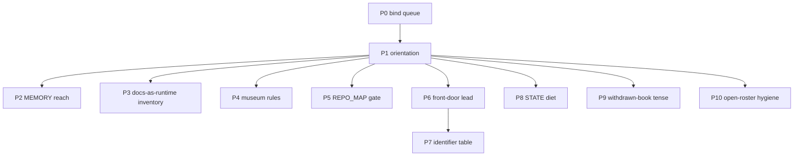

# Repo pain-point packets — sequencing charter

> **For agentic workers:** This is a **portfolio**, not one implementation. Each packet below needs its own later plan (or is already owned). Do not scaffold packet work from this file. REQUIRED when a packet is GO’d: writing-plans → a dated `docs/superpowers/plans/YYYY-MM-DD-<packet>-implementation.md`.

**AUTHORIZATION:** Plans only. No packet in this file is GO’d by committing it. Bind ([`2026-08-23-bind-operator-queue-implementation.md`](2026-08-23-bind-operator-queue-implementation.md)) **GO landed 2026-08-23**; bind row 3 then **closed** (Lane A scoped decline; last pre-G0 slot unspent). P2 Approach A **GO landed 2026-08-23** ([plan](2026-08-23-p2-memory-demote-implementation.md)). P3 **GO landed 2026-08-23** ([plan](2026-08-23-p3-docs-runtime-inventory-implementation.md)). P4 **GO landed 2026-08-23** ([plan](2026-08-23-p4-museum-rules-implementation.md)). P5 **GO landed 2026-08-23** ([plan](2026-08-23-p5-repo-map-layers-implementation.md)). Keep-20 roll + W5 CI-from-`gates.yml` (H6) **GO landed 2026-08-23**. Buildable packets P0–P5 and those two parked GOs are closed. **P6–P10 GO landed 2026-08-23** ([plan](2026-08-23-p6-p10-residuals-implementation.md)). Not a queue row.

**Goal:** Name the first-look / second-look pain points that the bind plan explicitly left open, group them into independent packets, and sequence them so we do not open a new control-plane campaign that recreates the defect. Second wave: split leftover first-look claims into packets that do not duplicate P0–P5, keep-20, W5 H6, or the [`viable-strategy sequence`](2026-08-23-viable-strategy-sequence-overview.md).

**Architecture:** One charter, six first-wave packets (closed), five second-wave packets (P6–P10, landed 2026-08-23), one parked-with-owner list. Packets are independent (different files, different falsifiers). Only one may sit on the operator queue at a time (Survive cap). Object-layer dryness is **not** a pain-point packet — it already has the viable-strategy sequence (`AWAITING GO`).

**Tech Stack:** none in this charter. Per-packet stacks live in the later implementation plans.

## Global Constraints

- No second Great Prune; no hard doc-budget gate ([`2026-08-08-great-prune.md`](../../adr/2026-08-08-great-prune.md) F-2 addendum declined).
- No hours budget (Rule 2 §5 #2).
- No new generation channel (bind row 3 fills from an existing owner).
- No sixth root doc ([`2026-07-16-root-doc-charter-dedup.md`](../../adr/2026-07-16-root-doc-charter-dedup.md)).
- Empty grep of `lab/archive/`, `docs/ltm/`, `core/strategies/_archive/` is **not** evidence of absence ([`.cursor/rules/search-ltm.mdc`](../../../.cursor/rules/search-ltm.mdc)).
- `repo_retrieve.py` remains ASSISTIVE-ONLY (Limb B settled).

## What the two looks actually claimed

| Claim | Disposition in this charter |
|---|---|
| Control plane eats the operator queue | **P0 bind** — already planned |
| Generation funnel cannot admit | **Not a packet.** Bind row 3 closed; object-layer owner is the [`viable-strategy sequence`](2026-08-23-viable-strategy-sequence-overview.md) (`AWAITING GO`). Do not open a fifth generation channel. |
| Docs-as-runtime (prune classifier 4.3%) | **P3 inventory** — index, not delete |
| `ACTIVE` ≠ in-flight | **P1** — CATALOG `hot` column already exists; remaining work is orientation + no mass-stamp |
| MEMORY.md is Rule 7 owner but outside git | **P2** — D1 of the 2026-08-18 assumptions sweep |
| Museum operational rules / stale LOCK path | **P4** |
| `REPO_MAP.md` hand-coupled to `check_boundaries.py` | **P5** |
| Hop-table / vocabulary tax | **P1** (same packet; no new glossary root file) |
| W5 CI-from-`gates.yml` | **Landed 2026-08-23** (H6 HOLD lifted) |
| SESSIONS keep-20 roll | **Landed 2026-08-23** |
| Personas, dual venvs/skills, folder name vs `first-passage` | Parked — operating-model, not a defect to “fix” in-tree |
| Pine gitignored; LTM search exclude | Parked — correct scars; P1 teaches them |
| README lead still sells “deploy at four firms” | **P6** — front-door lead sentence |
| Identifier collision (P/S/F/B/M/G/Q series) | **P7** — identifier table (not a sixth root file) |
| STATE decision-index + standing-lead accretion | **P8** — STATE diet (keep-20 did SESSIONS only) |
| Live-surface tense on a withdrawn book | **P9** — docstring / table framing only |
| INDEX Open rows that are not open | **P10** — roster hygiene |
| No admitted candidate / four-firm §4 | **Not a packet.** [`viable-strategy sequence`](2026-08-23-viable-strategy-sequence-overview.md) (`AWAITING GO`) |
| CI green ≠ merge gate / no branch protection | ⚠ **Stale as written (corrected 2026-08-24).** Limb-A does **not** stand: the `main-protection` ruleset landed 2026-08-19 (PR required, `skills (3.12)` required, no bypass) — [`Q-GATESTACK-1`](../../briefs/closures/Q-GATESTACK-1-closure-falsified.md) closure addendum. Only the *other* checks remain advisory |
| Personas / dual agent surfaces | Parked — operating model (unchanged) |
| S3/S7 still `PROPOSED`; session lettering | Parked — leave; do not reopen S7 |

P2–P5 are closed. P6–P10 landed 2026-08-23 (same PR; README + STATE diet + tense + Q-TOM-SPX-1 DEAD). Only one may sit on the operator queue at a time (Survive cap).

---

### P0 — Bind the operator queue

**Owner plan:** [`2026-08-23-bind-operator-queue-implementation.md`](2026-08-23-bind-operator-queue-implementation.md)

**Start when:** done — row 3 named (Lane A). Remaining bind work is this land, not a second GO.

**Not this packet:** CATALOG, MEMORY, prune inventory, CI-from-gates, keep-20.

---

### P1 — Orientation (status words + hop table)

**Problem:** `LOCKED`, `ACTIVE`, `eval is live`, `four-layer`, `AUTHORIZED @ 1.00×` do not mean English. [`lab/CATALOG.md`](../../../lab/CATALOG.md) already has a `hot` column ([`2026-08-22-catalog-hot-vs-disposition.md`](../../adr/2026-08-22-catalog-hot-vs-disposition.md) Phase 1 landed). The remaining confusion is the **status** token still reading as a work queue (86 `ACTIVE` rows, many decided).

**Do:**

- Add a 8–12 row **status glossary** to [`README.md`](../../../README.md) §Where to look (not a sixth root file): `LOCKED` (parameter axis) vs authorization ladder; CATALOG `hot` vs `status`/`disposition`; `eval is live` = account exists, rail disarmed, no book; four-layer = three dirs + root-resident governance; `AUTHORIZED @ 1.00×` = code default, not a live haircut.
- One sentence: empty default-grep of archive/LTM/`_archive` is not absence.
- One sentence: Pine + vendor CSVs are gitignored; CARD/LOCK stubs + manifests are the public surface.

**Do not:**

- Mass-stamp `**Verdict:**` or mass `--slug` ([catalog ADR](../../adr/2026-08-22-catalog-hot-vs-disposition.md) §5 / §7: separate GO).
- Rewrite [`lab/CATALOG.md`](../../../lab/CATALOG.md) by hand (regenerator-only).
- Add `docs/glossary.md`.

**Start when:** bind has landed, **or** the same PR if the edit is README-only (pointer-only; no new gate). README glossary landed on this branch (`2026-08-24p`); do not mass-stamp CATALOG.

**Falsifier:** a newcomer reading README §Where to look still cannot tell `ACTIVE` from “in-flight.”

---

### P2 — MEMORY.md reach (assumptions-sweep D1)

**Problem:** Rule 7 names `MEMORY.md` + memory files as the owner of durable atomic facts ([`docs/operational_rules.md`](../../operational_rules.md) §7). That path is `C:\Users\joshu\.claude\projects\C--Users-joshu-multi-firm-operations\memory\MEMORY.md` — outside the worktree. No retention test, no gate. A stale line re-enters every session as settled fact. Recorded as D1 in [`docs/notes/audits/2026-08-18-strategy-generation-assumptions-sweep.md`](../../notes/audits/2026-08-18-strategy-generation-assumptions-sweep.md).

**Approaches (pick at packet GO; recommended = A):**

- **A — Demote the owner.** Rule 7 line becomes: durable atoms live in owning ADRs / `docs/methodology/lessons/`; MEMORY is assistive, never attestation. Matches Limb B’s `repo_retrieve` disposition.
- **B — Track a pointer index only.** A gitignored-corpus manifest (`docs/memory_index.md`: titles + one-liners, no lesson bodies) so drift is visible. Does **not** import Claude project memory into the public clone.
- **C — Copy the corpus in-tree.** Reject. Public repo + mixed secrets/lessons.

**Do not:** treat a MEMORY paste as Rule 0 evidence; sync the Claude project directory.

**Start when:** GO landed 2026-08-23, Approach A (operator: P2 as queue #3).

**Falsifier:** Rule 7 still names an unreadable-from-clone path as canonical owner, with no “assistive-only” mark.

---

### P3 — Docs-as-runtime inventory (not a prune)

**Problem:** The Great Prune’s delete classifier precision was 4.3%. Code reads markdown at runtime (prereg paths in `register_search.py`, pathlib joins to the M1 acceptance artifact, regex over `CLAUDE.md` in `ops/recall/guard.py`). Future prune law already says: start from an inbound-reference index built from *prose and hook* citations, not markdown links ([`2026-08-08-great-prune.md`](../../adr/2026-08-08-great-prune.md) §3.2 / §4a).

**Do:**

- One script, report-only: scan `core/`, `ops/`, `lab/`, `scripts/`, `tests/` for string literals and `pathlib` joins that mention `docs/`, `CLAUDE.md`, `STATE.md`, `PIPELINES.md`, `REPO_MAP.md`.
- Emit `docs/notes/audits/docs-runtime-inventory.md` (generated; do not hand-edit).
- No deletions. No `gates.yml` HARD fail on the inventory in v1 (report-only, like `pursuit-records` / `sync-liveness`).

**Do not:** delete any `docs/` file; escalate to a doc-budget gate; treat the inventory as a prune list.

**Start when:** GO landed 2026-08-23 (operator: P3 as queue #3). Independent of P2/P4/P5.

**Falsifier:** a known runtime read (e.g. `ops/recall/guard.py` → `CLAUDE.md`, `register_search.py` reachability attestation paths) is missing from the generated inventory.

---

### P4 — Museum rules and stale owner paths

**Problem:** [`docs/operational_rules.md`](../../operational_rules.md) Rule 1 is still written as live Guardian-signal law; Guardian is cold-stored / venue-less. Rule 3 is already `HISTORICAL / DORMANT` (good). Rule 7 lock-state owner still says `core/strategies/<strat>/LOCK.md`; files live at `core/strategies/_archive/<family>/LOCK.md` ([`core/strategies/CATALOG.md`](../../../core/strategies/CATALOG.md)).

**Do:**

- Rule 1: keep the *principle* (no per-trade skip of a valid signal; overlays only). Move the Guardian/Iran story to [`docs/methodology/lessons/`](../../methodology/lessons/) or mark the origin `HISTORICAL` the way Rule 3 already does. Do not delete the origin — it is why the rule exists.
- Rule 7: retarget the lock-state row to `_archive/<family>/LOCK.md` + CARD stubs, matching the catalog.
- Do not touch Rule 5 (Pine canonical) or live `dd_protection` / `firm_rules` rows.

**Start when:** GO landed 2026-08-23 (operator: close remaining pain-point packets).

**Falsifier:** Rule 1 still reads as “Guardian is a live book,” or Rule 7 still points at `core/strategies/<strat>/LOCK.md`. — **cleared**.

---

### P5 — `REPO_MAP.md` ↔ `check_boundaries.py` coupling

**Problem:** [`REPO_MAP.md`](../../../REPO_MAP.md) header: the scanner **never opens this file**; it hard-codes `APP_LAYER_PREFIX` / `GOVERNANCE_PREFIXES` / `SCRIPTS_LAYER` in [`scripts/check_boundaries.py`](../../../scripts/check_boundaries.py); **no gate compares the two**.

**Do:**

- A checker that fails if the three dicts/prefixes in `check_boundaries.py` drift from a *small machine block* added to `REPO_MAP.md` (fenced YAML or a `scripts/repo_map_layers.yml` sibling — pick one in the packet plan; do not parse free prose).
- Wire path-conditional on `^(REPO_MAP[.]md|scripts/check_boundaries[.]py|scripts/repo_map_layers[.]yml)$`.
- Tests: mutate one prefix in a tmp copy → fail; matching copies → pass.

**Do not:** make `check_boundaries.py` import `REPO_MAP.md` as its runtime map (the scanner’s job is AST edges, not markdown). Keep the hard-coded dicts; compare them.

**Start when:** GO landed 2026-08-23 (operator: close remaining pain-point packets).

**Falsifier:** a prefix exists in `APP_LAYER_PREFIX` and not in the machine block (or the reverse) and `make check` is green. — **cleared**.

---

## Second wave — first-look residuals (plans only, 2026-08-23 evening)

Amendment-first: this charter is the owner. Do not open a parallel “first-look campaign.” Do not scaffold implementation plans until a packet is GO’d. Do not promote any of these as queue #3 without operator election.

Attestation (this session, before authoring): `lab/CATALOG.md` and `docs/briefs/INDEX.md` have no `front-door lead` / `identifier collision` / `open-roster` / `STATE diet` packet rows. Nearest owners: this file (P1 glossary), [`2026-07-16-root-doc-charter-dedup.md`](../../adr/2026-07-16-root-doc-charter-dedup.md) (no sixth root doc), [`scripts/roll_sessions.py`](../../../scripts/roll_sessions.py) (keep-20 — SESSIONS only), [`Q-TOM-SPX-1`](../../briefs/Q-TOM-SPX-1.md) (P10 exemplar), [`viable-strategy sequence`](2026-08-23-viable-strategy-sequence-overview.md) (object-layer dryness — not P6–P10).

---

### P6 — Front-door lead sentence

**Problem:** P1 taught the glossary. The first sentence of [`README.md`](../../../README.md) still reads as a live deploy program at four firms. Sentence 2 then contradicts it (“no deployed book”). A first-look reader who stops at the title block is misled. [`PIPELINES.md`](../../../PIPELINES.md) is already honest; the front door is not.

**Do:**

- Rewrite README’s opening block so the **first sentence** names the actual object: research + disarmed rail + no book. Keep “four automation-friendly firms” as the **program target**, not as current activity. One clause, not a paragraph.
- One pointer to [`PIPELINES.md`](../../../PIPELINES.md) “what is turning” stays. Do not restate [`CLAUDE.md`](../../../CLAUDE.md) §Live-execution posture (Rule 7).
- Optional same-PR: `PIPELINES.md` inventory header already says BUILT · DISARMED — leave unless a first-line contradiction remains after the README edit.

**Do not:**

- Add a sixth root doc or `docs/glossary.md`.
- Touch `CLAUDE.md` lock-surface literals (`99.83%` / `0.17%` / `p99 DD 4.37%`) — `ops/recall/guard.py` parses them.
- Open the viable-strategy sequence from this packet.

**Start when:** GO landed 2026-08-23.

**Falsifier:** a newcomer reading only README lines 1–12 still cannot tell whether a book is deployed.

---

### P7 — Identifier collision table

**Problem:** P1 covered English-looking **status words**. It did not cover colliding **ID series**. A reader meets P1–P6 (`PIPELINES.md`), P0–P5 (this charter), Phase A–D (viable-strategy), S1–S7 + S2b (loop specs), F1/F2/F3 (S1 forks), B6/B7 (rail stages), M1 vs M-A/M-B/M-C (monitoring), G0–G8 (survivor gates), and `Q-*` (briefs) in the same afternoon.

**Do:**

- Add 6–8 rows to the existing README **Status words** table (not a new file): each row is `Series | Means | Does not mean | Owner`.
  - `P1–P6` = pipelines in `PIPELINES.md` ≠ this charter’s P0–P5 ≠ viable-strategy Phase A–D
  - `S1–S7` = closed-loop specs ≠ S2b daemon ≠ Survive queue
  - `F1/F2/F3` = S1 environment forks (owner: S1 ADR)
  - `B6/B7` = c1 rail stages (owner: GO ADR)
  - `M1` = venue-native monitoring maturity ≠ Q-MONSURF M-A/M-B/M-C
  - `G0–G8` = survivor-scoring gates (owner: strategy-validation / W4)
  - `Q-*` = brief roster (owner: `docs/briefs/INDEX.md`)
- Owners are links only. Do not restate current status of any series.

**Do not:**

- Rename any series (that is a campaign, not this packet).
- Add `docs/glossary.md`.
- Expand the table past ~20 rows; if it does not fit, drop the lowest-collision series and leave a pointer at `docs/spec/2026-08-07-loop-spec-index.md` + this charter.

**Start when:** GO landed 2026-08-23.

**Falsifier:** README still has no row that distinguishes pipeline-P from pain-point-P from phase-letter.

---

### P8 — STATE executed-decision index diet

**Problem:** Keep-20 rolled [`docs/SESSIONS.md`](../../SESSIONS.md). [`STATE.md`](../../../STATE.md) still claims “pointers only” and then carries (a) a growing executed-decision index that already blew the Great Prune “newest 15” truncation, and (b) a 2026-08-23 **Standing lead** paragraph that is mechanism-supply narrative, not a queue row. Rule 7 was restored to one-line + owner on 2026-08-22 and has drifted again.

**Approaches (pick at packet GO; recommended = A):**

- **A — Roll the index.** Sibling of keep-20: archive executed-decision bullets older than a named keep-N into `docs/ltm/` (or a dated archive note), leave newest N + the standing-base-case pointer. Mechanical, reversible.
- **B — Cap in place.** Re-assert the Great Prune “newest 15” cut with a checker. No archive file. Loses scan-ability of mid-August decisions except via `git show`.
- **C — Delete the index.** ADRs + SESSIONS already own the narrative. Highest diet; highest “where did that GO live” cost.

**Do (all approaches):**

- Move or delete the **Standing lead** paragraph from `STATE.md`. Mechanism-supply lead already lives on [`viable-strategy sequence`](2026-08-23-viable-strategy-sequence-overview.md) + Use-4 notice. STATE keeps a **one-line pointer**, not the lane prose.
- Do not add a sixth root doc. Do not invent an hours budget (Rule 2 §5 #2).

**Do not:**

- Re-roll SESSIONS (keep-20 already landed).
- Edit historical ADR bodies to shrink the index.
- Auto-open a queue row to “hold” the standing lead.

**Start when:** GO landed 2026-08-23, Approach A (keep-15).

**Falsifier:** `STATE.md` still contains a multi-sentence mechanism-supply narrative above the operator queue, or the executed-decision index is longer than the elected keep-N with no archive pointer.

---

### P9 — Withdrawn-book live-surface tense

**Problem:** Coldstore B/C moved living `BASE_RISK`. P4 retargeted operational-rules museum paths. The live defect is one sentence in [`ops/c1_rail/c1_sizing_host_reference.py`](../../../ops/c1_rail/c1_sizing_host_reference.py): “This module IS the live sizing host” (predates the 2026-08-04 book withdrawal). The same docstring already records the NinjaScript/NT8 port as “a dormant fallback and was never built” — leave that clause. [`CLAUDE.md`](../../../CLAUDE.md) Strategy Reference table is still readable as current architecture. `firm_rules.py` provenance novels stay — they pin `cost_per_side_usd`, they are not tense defects.

**Do:**

- Retense only the “IS the live sizing host” sentence: listener’s sizing reference **when armed**; no book is deployed. Do not rewrite the already-accurate NT8/NinjaScript dormant clause. Do not change `r_eff` / `qty` / fail-safe behavior.
- One sentence on the CLAUDE Strategy Reference table: historical record of the locked CFD / withdrawn futures editions; not a live book. Do not move or delete the table (guard.py / lock-surface).
- Grep blast-radius for “IS the live sizing host” on hot surfaces only; repair silent restatements of that tense.

**Do not:**

- Change `BASE_RISK`, `LEG_MAP`, `dd_protection`, Pine, or arming code.
- Shorten `firm_rules.py` Bulenox/cost provenance comments.
- Touch `99.83%` / `0.17%` / `p99 DD 4.37%` literals.

**Start when:** GO landed 2026-08-23.

**Falsifier:** `c1_sizing_host_reference.py` docstring still asserts the module is the live host of a deployed book.

---

### P10 — Open-roster dead rows

**Problem:** [`docs/briefs/INDEX.md`](../../briefs/INDEX.md) Open table still carries rows whose status is not open. Exemplar: **Q-TOM-SPX-1** — Layer A `RESOLVED-ABSENT` since 2026-06-16, “formal DEAD close reserved.” Open does not mean open. Distinct from mass-CATALOG (catalog ADR forbids a stamp without its own GO).

**Do:**

- Census INDEX **Open** rows whose status token is `RESOLVED-ABSENT` / `CLOSED` / `formal DEAD reserved` / equivalent. Produce a one-page list (paths + status + recommended disposition). Do not auto-close.
- Operator elects per row: formal DEAD/STOP close (closure record + delete Open row) **or** leave reserved with a dated reason.
- Default exemplar: Q-TOM-SPX-1 — close DEAD unless the operator still wants the reserved native-Pine confirmation. Next action on that brief currently names a Pine confirmation that has been unpaid since June.

**Do not:**

- Touch Q-SIGID-1 or Q-FILLTAX-1 (those are actually open).
- Mass-stamp `lab/CATALOG.md` (catalog ADR §5 / §7).
- Invent a new Q to hold the census.

**Start when:** GO landed 2026-08-23. Census is $0; Q-TOM-SPX-1 closed DEAD.

**Falsifier:** Q-TOM-SPX-1 remains in INDEX Open after a GO that elected formal DEAD, or a live Open row (Q-SIGID-1 / Q-FILLTAX-1) was closed by this packet.

---

## Parked — already have an owner, or not a defect

| Item | Why parked | Owner |
|---|---|---|
| W5 CI-from-`gates.yml` (H6) | **Landed 2026-08-23** | [`2026-08-23-w5-ci-from-gates-yml-implementation.md`](2026-08-23-w5-ci-from-gates-yml-implementation.md) · [W5 addendum](../../adr/2026-08-07-w5-governance-diet.md#addendum-2026-08-23--h6-hold-lifted-ci-composition-from-gatesyml) |
| SESSIONS keep-20 roll | **Landed 2026-08-23** | [`scripts/roll_sessions.py`](../../../scripts/roll_sessions.py) · archive `docs/ltm/notes/archive/sessions/` |
| Generation dryness | bind row 3 closed; object-layer sequence already authored | [channel ADR addendum](../../adr/2026-08-15-no-counterparty-statistical-sourcing-channel.md#addendum-2026-08-23--scoped-decline-of-the-reopened-6am6a-and-gcmgc-entry-geometry--dense-1m-cell) · [`viable-strategy sequence`](2026-08-23-viable-strategy-sequence-overview.md) |
| Mass CATALOG Verdict / `--slug` | catalog ADR forbids without its own GO | [`2026-08-22-catalog-hot-vs-disposition.md`](../../adr/2026-08-22-catalog-hot-vs-disposition.md) |
| Personas / dual skill homes / two venvs | operating model | leave |
| CI green ≠ merge precondition / no branch protection | ⚠ **Stale (corrected 2026-08-24)** — ruleset landed 2026-08-19; `skills (3.12)` IS required | [`Q-GATESTACK-1`](../../briefs/closures/Q-GATESTACK-1-closure-falsified.md) closure addendum |
| S3/S7 `PROPOSED`; session lettering | leave; do not reopen S7 | [`loop-spec index`](../../spec/2026-08-07-loop-spec-index.md) · [`roll_sessions.py`](../../../scripts/roll_sessions.py) |
| Folder `multi_firm_operations` vs GitHub `first-passage` | cosmetic identity | operator-only |
| Pine gitignored; LTM `.rgignore` | correct; P1 teaches | [`.cursor/rules/search-ltm.mdc`](../../../.cursor/rules/search-ltm.mdc) |
| Windows `bash` vs Git Bash for hooks | **Landed** — sentence on `install_hooks.sh` | [`scripts/install_hooks.sh`](../../../scripts/install_hooks.sh) · [`scripts/install_hooks.bat`](../../../scripts/install_hooks.bat) |

## Success for this charter

The charter succeeds when every named packet has an owner, a start gate, and a falsifier, and none of them is being worked as an immortal SESSIONS leftover. **P0–P10 + keep-20 + W5 H6 landed 2026-08-23.** Remaining parked rows stay parked.
