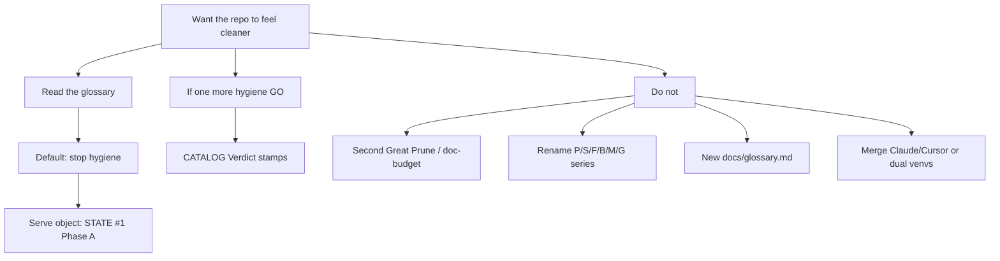

# Repo clean recommendations — detailed plan (not a P11 campaign)

> **For agentic workers:** Advice + glossary. **Not a packet GO.** Do not stamp
> CATALOG, do not GO Phase A, do not prune, from this file. REQUIRED when a
> later packet is GO’d: writing-plans → a *new* dated implementation plan
> (catalog-verdict-stamp or Phase A already exists).

**AUTHORIZATION:** operator asked this session to develop, commit, and PR the
recommendations (`queue-exception: operator asked to land the clean-recommendations
plan`). Not a `STATE.md` queue row. Does **not** GO
[`2026-08-23-viable-strategy-phase-a-target-derivation.md`](2026-08-23-viable-strategy-phase-a-target-derivation.md)
or a CATALOG Verdict stamp. Charter
[`2026-08-23-repo-pain-point-packets.md`](2026-08-23-repo-pain-point-packets.md)
P0–P10 stay closed; this file is not P11.

**Routing note:** `cursor/*` branch touching `docs/superpowers/` +
`docs/SESSIONS.md`. One-packet exception to
[`2026-07-14` §2 routing test 1](../../adr/2026-07-14-cc-cursor-surface-allocation.md)
(same treatment as the P6–P10 land). Advice, not new doctrine. Does not widen
Cursor’s doctrine-authoring eligibility.

**Goal:** one readable owner for “what is messy / what to do / what not to
reopen,” including the front-door glossary, so the next session does not
re-derive a hygiene campaign.

**Live queue (read `STATE.md` first; this plan does not change it):**

- `#1` Acceptable strategy on the ruled host — Phase A GO unpaid.
  [`overview`](2026-08-23-viable-strategy-sequence-overview.md) ·
  [`Phase A`](2026-08-23-viable-strategy-phase-a-target-derivation.md)
- `#2` B7-REFIRE Stage 1 + M1 — waits on `#1`.
  [`GO addendum`](../../adr/2026-07-17-c1-rail-build-account-registration-go.md) ·
  [`M1`](../../adr/2026-07-22-c1-venue-native-monitoring-maturity.md)

`Q-TRADECAP-2` is `RESOLVED` (elect-2, observe-only). Do not cite the retired
per-trade-bound queue row as live.

---

## Amendment-first / sub-rule 8 (this session, before authoring)

```
$ rg -n 'repo-clean|clean-recommendations|catalog-verdict-stamp|front-door glossary' \
    lab/CATALOG.md docs/briefs/INDEX.md docs/superpowers/plans docs/adr
(no matches)

$ git log --oneline origin/main -8
7631949 Merge pull request #144 … tradecap-2-election-packet
b855b4a docs: put mechanism supply ahead of B7/M1 on the operator queue
57d8100 docs: ratify Q-TRADECAP-2 elect-2 (Accepted); close the Q
3dd08c1 Merge pull request #143 … pain-point-p6-p10
```

Nearest owners: the pain-point charter (P0–P10 closed; CATALOG Verdict parked),
[`2026-08-22-catalog-hot-vs-disposition.md`](../../adr/2026-08-22-catalog-hot-vs-disposition.md)
§5, [`README.md`](../../../README.md) §Where to look (glossary), Phase A plan
(object). No existing `docs/glossary.md`. Default is amend-in-place on the
charter (pointer only) plus this new file (no owner could hold the full
recommendation without becoming a P11).

---

## Standing recommendation

**Stop opening hygiene campaigns.** P0–P10 landed 2026-08-23. Another
P11–P20 charter recreates the defect the charter named: cleaning becomes a
third product.

The remaining first-glance mess is **vocabulary + an idle object**, not
unsorted files. Keep the glossary; do not rename series; do not add
`docs/glossary.md`.



---

## Glossary (living owner: [`README.md`](../../../README.md) §Where to look)

These tokens do not mean English. P1 landed status words; P7 landed identifier
series. This section copies both so the recommendation is readable without
hopping. **Do not** add `docs/glossary.md` or a sixth
root doc ([root-doc charter](../../adr/2026-07-16-root-doc-charter-dedup.md)).
If a row is wrong, amend README. Do not restate current *values* of any series.

### Status words

- `LOCKED` — parameter axis is frozen (SL/TP/ATR/risk%/pyramid/Pine). Does not
  mean capital is authorized indefinitely. Owner:
  [`strategy_lifecycle.md`](../../methodology/strategy_lifecycle.md).
- `CANDIDATE` → `AUTHORIZED` → `WATCH` → `RETIRED` — capital-authorization
  ladder (revocable; down-only plus S5 sandbox-up). Does not mean a parameter
  edit. Same owner.
- `AUTHORIZED @ 1.00×` — code default when `lifecycle_state.json` is absent.
  Does not mean a live deployed haircut. Owner: [`CLAUDE.md`](../../../CLAUDE.md)
  §Strategy Authorization Lifecycle.
- eval is live — the incumbent Tradeify eval account exists. Does not mean a
  book is trading or the rail is armed. Owner: [`CLAUDE.md`](../../../CLAUDE.md)
  §Live-execution posture.
- four-layer — `core/` · `lab/` · `ops/` plus root-resident governance. Does
  not mean a physical `governance/` directory. Owner:
  [boundaries ADR](../../adr/2026-06-05-monorepo-layer-boundaries.md) ·
  [`REPO_MAP.md`](../../../REPO_MAP.md).
- CATALOG `hot` — body still lives under `lab/analysis/<theme>/<slug>/`. Does
  not mean the campaign is in-flight. Owner:
  [catalog-hot ADR](../../adr/2026-08-22-catalog-hot-vs-disposition.md).
- CATALOG `status` — disposition word (`ACTIVE` / `HOLD` / `FALSIFIED` / …).
  Does not mean a work queue. Same owner · [`lab/CATALOG.md`](../../../lab/CATALOG.md).
- `ACTIVE` — often the `status` token on a stay-hot card. Does not mean
  in-flight / undecided / “do this next.” Same owner.
- Survive queue — the numbered [`STATE.md`](../../../STATE.md) rows (cap ≤5).
  Does not mean every leftover name in SESSIONS. Owner: STATE ·
  [Survive-bound ADR](../../adr/2026-08-09-survive-bound-is-the-queue-cap.md).
- `Open / next` — queue-led pointer on the newest SESSIONS entry. Does not
  mean the prior leftover cluster is the work list. Owner:
  [`SESSIONS.md`](../../SESSIONS.md) header.

### Identifier series (same letter, different objects)

- pipeline `P1–P6` — object pipelines in [`PIPELINES.md`](../../../PIPELINES.md).
  Not pain-point P0–P10, not viable-strategy Phase A–D.
- pain-point `P0–P10` — repo-hygiene packets. Not pipeline-P or phase-letter.
  Owner: [pain-point charter](2026-08-23-repo-pain-point-packets.md).
- Phase A–D — viable-strategy sequence phases. Not pipeline-P or pain-point-P.
  Owner: [sequence overview](2026-08-23-viable-strategy-sequence-overview.md).
- `S1–S7` — closed-loop specs. Not the S2b daemon, not the Survive queue.
  Owner: [loop-spec index](../../spec/2026-08-07-loop-spec-index.md).
- `F1/F2/F3` — S1 environment forks. Not pain-point-F or firm-class F. Owner:
  [S1 ADR](../../adr/2026-08-07-loop-s1-environment-ratification.md).
- `B6/B7` — c1 rail stages. Not pipeline-P or pain-point-P. Owner:
  [rail GO ADR](../../adr/2026-07-17-c1-rail-build-account-registration-go.md).
- `M1` — venue-native monitoring maturity. Not Q-MONSURF M-A / M-B / M-C.
  Owner: [M1 ADR](../../adr/2026-07-22-c1-venue-native-monitoring-maturity.md).
- `G0–G8` — survivor-scoring gates. Not GRAND-tier G or generation-G. Owner:
  [strategy-validation](../../../.claude/skills/strategy-validation/SKILL.md).
- `Q-*` — brief roster. Not queue rows. Owner:
  [`docs/briefs/INDEX.md`](../../briefs/INDEX.md).

### Also collide (pointer-only; not extra README rows — P7 capped ~20)

- pipeline `X` — governance/discipline layer in
  [`PIPELINES.md`](../../../PIPELINES.md). Rides on P1–P6; not a seventh
  object pipeline.
- `W1–W5` — closed-loop / governance-diet waves (W1 honest clock, W4 gate
  dormancy, W5 diet). Not week numbers.
- `M-A` / `M-B` / `M-C` — Q-MONSURF monitoring classes. Not `M1`.
- GRAND — pursuit-tier above STRATEGIC. Not `G0–G8`.
- Rule 0 / Rule 7 — audit-first production read; one canonical owner per fact.
  Owners: [`rule_0.md`](../../rule_0.md) ·
  [`operational_rules.md`](../../operational_rules.md) §7.

An empty default-grep of `lab/archive/`, `docs/ltm/`, or
`core/strategies/_archive/` is not evidence the work is absent. Pine and
vendor CSVs are gitignored; CARD/LOCK stubs plus manifests are the public
surface.

### Glossary maintenance

1. README is the only living table. Cap ~20 rows (P7).
2. Overflow stays in this section (“Also collide”), not a new file.
3. A missing collision is an amend of README *or* this overflow list — never
   `docs/glossary.md`.
4. Do not restate live values (risk %, bust %, queue titles as if owned here).

---

## Do not do (settled)

- **Second Great Prune / mass `docs/` delete.** Classifier precision 4.3%;
  classes 3 and 5–8 HALTED, not deferred.
  [Great Prune](../../adr/2026-08-08-great-prune.md) §3.2.
- **Hard doc-budget gate.** F-2 fired on counts; operator declined the
  prescribed gate (regrowth = decision throughput).
  [F-2 addendum](../../adr/2026-08-08-great-prune.md).
- **Rename identifier series.** P7: that is a campaign. The glossary is the map.
- **A new glossary file.** The glossary is the good idea; a second copy is not.
- **Treat the [docs-runtime inventory](../../notes/audits/docs-runtime-inventory.md)
  as a delete list.** P3 is report-only.
- **Mass `--slug` archive of stay-hot bodies.** Pins are real.
  [Catalog ADR](../../adr/2026-08-22-catalog-hot-vs-disposition.md) §2 item 5 / §5.
- **Merge `.claude/` + `.cursor/`, collapse two venvs, add branch protection,
  reopen S3/S7.** Parked operating-model.
  [Q-GATESTACK-1](../../briefs/closures/Q-GATESTACK-1-closure-falsified.md) Limb-A.
- **Drop gates under a “diet.”** [W5](../../adr/2026-08-07-w5-governance-diet.md) §5.
- **Casually shrink `STATE.md` forward-triggers.** The weekly/monthly rows exist
  so `daily-repo-truth-sync` can see them. P8 already rolled the decision index.
- **Auto-open a queue row to hold this advice.** Cap ≤5; succession is
  no-auto-replace.

---

## Process rules that organize without adding files

1. **Default: serve `#1`.** Phase A is the next doable object packet (GO
   unpaid). Hygiene only if it unblocks a first-glance lie.
2. **Amend-in-place** (Rule 8 / sub-rule 10). New audit notes only when no
   owner can hold the addendum.
3. **One hygiene item on the Survive cap at a time.** Do not auto-replace a
   closed hygiene row.
4. **Skip SESSIONS for pointer sweeps.** W5 class D.
5. **Leave `REPO_MAP.md` / `PIPELINES.md` archaeology.** Move-provenance;
   P5 already gates the live prefix maps.

---

## Object lane (default next work — already queued)

`STATE.md` `#1` *is* the clean that matters: an admitted strategy. This plan
does not restate Phase A. When the operator GOs it, execute
[`2026-08-23-viable-strategy-phase-a-target-derivation.md`](2026-08-23-viable-strategy-phase-a-target-derivation.md)
as written:

- **A1** — kill-register constraint-attribution audit ($0 / K=0). Empty
  revival list is a valid, decisive outcome.
- **A2** — payoff-shape feasibility map against Tradeify geometry.
- **A3** — conditional doctrine ruling; own operator GO.

`#2` (B7 / M1) stays blocked on `#1`. Do not arm, do not set `dry_run=false`,
do not place a trade from any hygiene or advice session.

---

## The one hygiene packet still worth a later GO

**CATALOG Verdict honesty.** Already named; forbidden without its own GO
([catalog ADR](../../adr/2026-08-22-catalog-hot-vs-disposition.md) §5).
Phase 1 (`hot` column + Verdict-wins parser) already landed. Remaining work
is stamping `**Verdict:**` on decided stay-hot source cards so `status=ACTIVE`
stops reading as a work queue (P1 falsifier).

### Cheap census (2026-08-24, this session — parent-side)

- [`lab/CATALOG.md`](../../../lab/CATALOG.md) Active table: **87** `ACTIVE`
  rows (`rg -c '^\| .* \| ACTIVE \|'`).
- `**Verdict:**` field on hot `RESULTS.md` / `README.md`: **~13** files
  (trainkill trio, geofit iid, monsurf idle-clock, polfront, limb-b remeasure,
  thirdleg map, wstruct, driftex, fts5, eodadv, eval_shape). Most ACTIVE
  rows have no Verdict field. The honesty gap is the packet.
- [`lab/analysis/README.md`](../../../lab/analysis/README.md) Phase 2 leftovers
  table remains the `--slug` pin list. Two slugs already carry
  `**Verdict:** FALSIFIED` and stay hot (`driftex_2026-08`, `eodadv_mnq_2026-08`).

### Recipe (only after a dedicated GO + implementation plan)

1. **Census, do not stamp.** For each Active `hot=yes` row, resolve the
   source card via `choose_source_card` in
   [`scripts/archive_lab_analysis.py`](../../../scripts/archive_lab_analysis.py):
   `RESULTS.md` > first `RESULTS_*.md` > `verdict.md` > `CLOSURE.md` >
   `README.md`. Parser reads the first `FIELD_HEAD_LINES` (**40**) lines.
   Blockquote-only Verdict lines do not count.
2. **Operator elects per row** (or a named batch): stamp
   `**Verdict:** <TOKEN>` as its own line, leave `**Status:** ACTIVE` if the
   body must stay hot. Tokens the parser already knows:
   `CLOSED` / `FALSIFIED` / `RETIRED` / `NULL` / `HOLD` / `ACTIVE` plus
   `_NON_TERMINAL_DOMINANT` (`HOLD` in the verdict clause still dominates).
   Do not invent a third schema.
3. **Regenerate only:**
   `python scripts/archive_lab_analysis.py --regenerate-catalog`
   (or `make lab-catalog`). Never hand-edit CATALOG table cells
   (C-P1-10).
4. **Do not `--slug`** unless both an archiveable disposition *and* the
   absence of a stay-hot pin hold. Pins live in the leftovers table +
   `_hot_sys_path_dependent`. Honesty and archival eligibility are
   decoupled (catalog ADR §2 item 5).
5. **Check:** `python scripts/check_status_consistency.py` (C2 joins to
   `hot`, not disposition class). Full pytest before merge if cards moved.

**Falsifier:** a newcomer reading the Active table can tell decided vs
in-flight without opening README.

**Forbidden under the later GO (preview):** mass `--slug`; renaming the
`status` column to `disposition`; a third CATALOG table; touching Pine /
`dd_protection` / rail.

This plan is **not** that GO. Promote as queue `#3` (cap ≤5) or write
`queue-exception`, then author
`docs/superpowers/plans/YYYY-MM-DD-catalog-verdict-stamp-implementation.md`.

---

## Architectural cleanup (later, not next)

Invert the prune: **stop code from parsing markdown.** Highest-leverage
example: [`ops/recall/guard.py`](../../../ops/recall/guard.py) regex-reads
`99.83%` / `0.17%` / `p99 DD 4.37%` from [`CLAUDE.md`](../../../CLAUDE.md)
([Great Prune §4a #6](../../adr/2026-08-08-great-prune.md)). Move those
literals to a small machine owner; keep CLAUDE as a pointer. Same class:
`register_search.py` reachability attestation paths; M1 acceptance
`pathlib` joins under `docs/notes/rail_build/`. Dedicated ADR only; safety
path, not a tidy. Do not reword the CLAUDE literals in the meantime.

---

## What “organized” means here

- Front door tells the truth in one screen; glossary is there to read
  (done: P1/P6/P7; copied here).
- Catalog tells the truth so `ACTIVE` does not need a glossary lookup
  (not done: Verdict stamps).
- Object work can start without another charter (blocked on Phase A GO,
  which is already queue `#1`).
- Governance stays large and gated — markdown is runtime; the last prune
  measured that.

Shrinking file count is the wrong metric. F-2 already proved count-regrowth
≠ dead material.

---

## Blast radius of *this* file

| Surface | Action |
|---|---|
| Pain-point charter | One-line pointer: this is advice, not P11. Parked CATALOG row unchanged. |
| `STATE.md` | No write. Queue unchanged. |
| `README.md` | No write. Glossary owner stays there. |
| `lab/CATALOG.md` | No write. |
| Phase A / viable-strategy | Pointer only. No GO. |
| Historical ADRs / P6–P10 plan | Leave. |

---

## Verification

```
# This plan exists; not an ADR (check_brief --type adr is the wrong type)
test -f docs/superpowers/plans/2026-08-24-repo-clean-recommendations.md

# Queue bind after the SESSIONS prepend
python scripts/check_sessions_queue_bind.py
# Expected: exit 0; newest Open/next cites #1 and #2

python scripts/roll_sessions.py --check-append-only
# Expected: no rewrite of already-merged entries

# No sixth glossary file
test ! -f docs/glossary.md

# Charter pointer present
rg -n '2026-08-24-repo-clean-recommendations' docs/superpowers/plans/2026-08-23-repo-pain-point-packets.md

# Cheap census still matches the numbers above (re-run, do not restamp)
rg -c '^\| .* \| ACTIVE \|' lab/CATALOG.md
# Expected: 87 (re-measure if origin/main moved)
```
